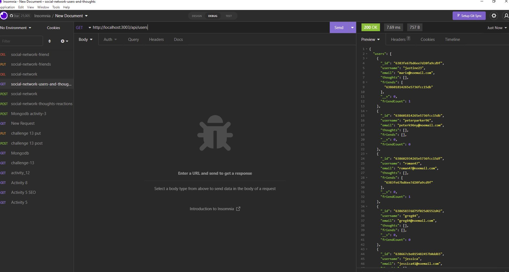
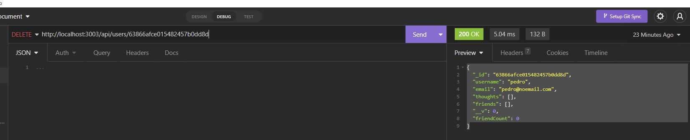
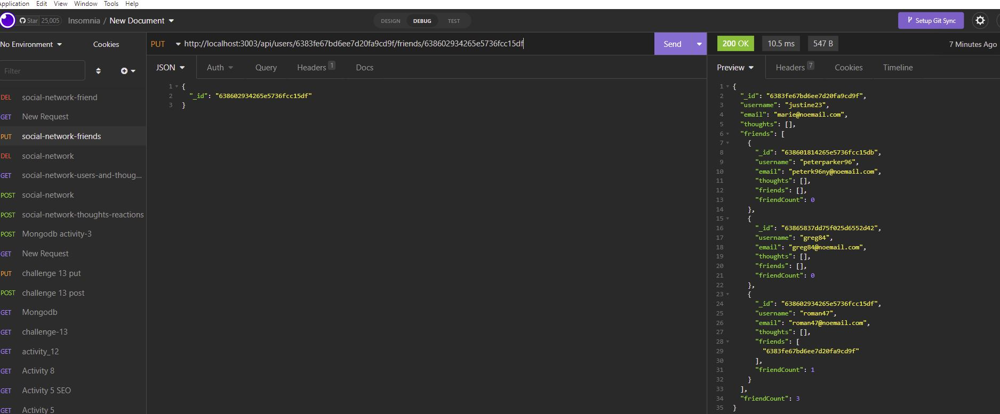
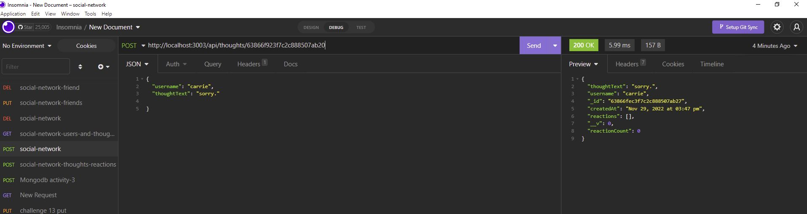
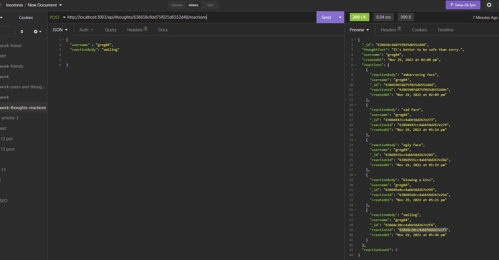

# Social-Network-API

This application allows us to search a list of users, thoughts, friends, and reactions per user, as well add and delete users. It uses a NoSQL database, Express.js, and Mongoose

## I added some of the following items:  
 

- Imported models and schemas
- Updated, deleted and created routes
- Tested routes using Insomnia
- Added screenshots of different requests
- Added video

## Sreenshots of the web page ##

## Installation ##
This application requires node and several dependencies like express, mysql, and Mongoose to run. The application can be started with npm start and for api endpoints testing, you can use Insomnia. 

## Usage ##
The application allows users to find the following: 
find users
find thoughts per each user
users'friends 
users'thoughts
user's reactions

## Links ##
- GitHub Repository
(https://github.com/noviceprogrammeroh/Social-Network-API)

## Videos ##
https://user-images.githubusercontent.com/66175531/204668658-948b477f-65ec-467b-8d60-510c0d8e59c7.mp4
## Videos ##
https://user-images.githubusercontent.com/66175531/204666070-5620cf94-463c-4292-bc99-aa3b9e66a6b8.mp4

